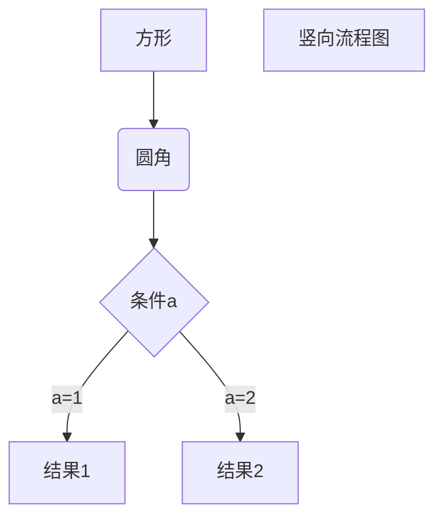

# web前端开发 mooc
## $2 - 1 HTML概述  
### _date: 03/01/2021_  

 

### __HTML:__ (HyperText MarkUp Language)  
"超文本标记语言"，它是制作网页的标准语言，不区分大小写  
"超文本"：通过超链接的形式将文本组织在一起  

 

### __标签:__  
* 由尖括号包围，比如 "\<title>"
* 通常是成对出现的
* eg: \<title> 百度一下，你就知道 \</title>  
开始标签和结束标签
* 单独出现的标签 eg: \  
 "/"表示结束

#### __标签嵌套：__
\<html>\<body>\</body>\</html>  
\<html>\<body>\</html>\</body>

#### __注意缩进：__  
|\<html>  外层: 父元素  
|&nbsp;&nbsp;&nbsp;&nbsp;&nbsp;&nbsp;|\<head>   内层: 子元素 1  
|&nbsp;&nbsp;&nbsp;&nbsp;&nbsp;&nbsp;|\</head>  
|&nbsp;&nbsp;&nbsp;&nbsp;&nbsp;&nbsp;|\<body>  内层: 子元素 2
|&nbsp;&nbsp;&nbsp;&nbsp;&nbsp;&nbsp;|  
|&nbsp;&nbsp;&nbsp;&nbsp;&nbsp;&nbsp;|\</body>  
|\</html>  
1、2 同级: 兄弟元素

 

### __元素:__
* eg: "\<title> 百度一下，你就知道 \</title>"  
整体称为元素 

 

### __属性:__